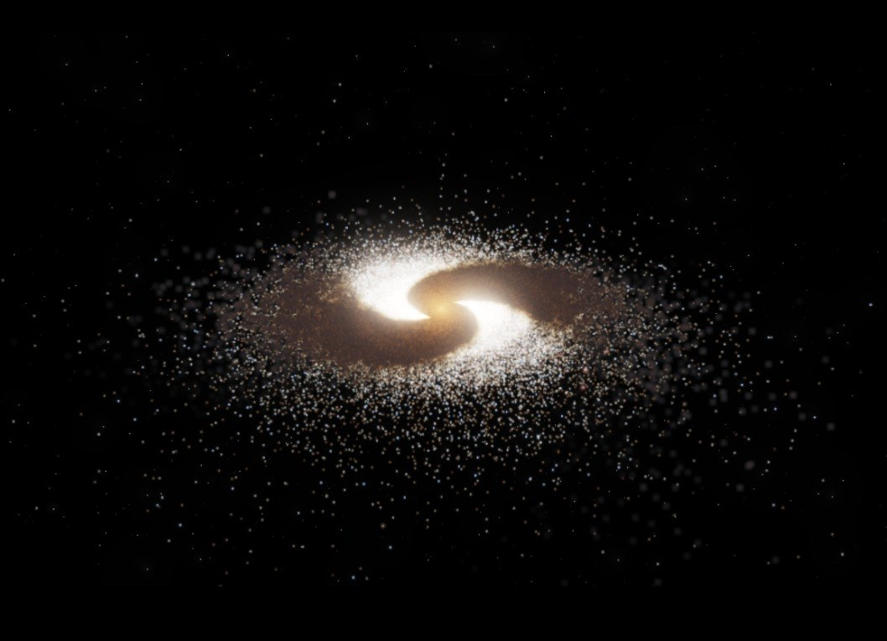
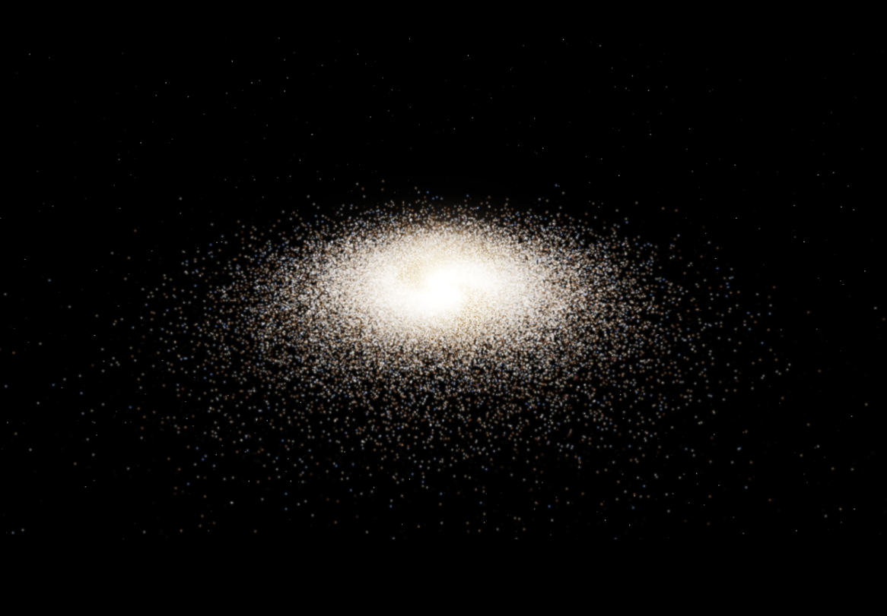
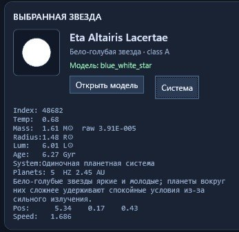
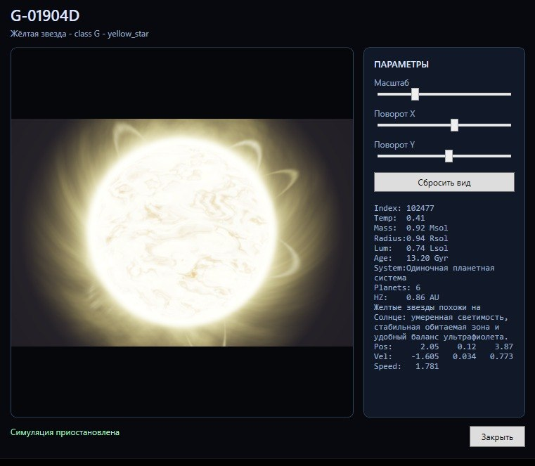
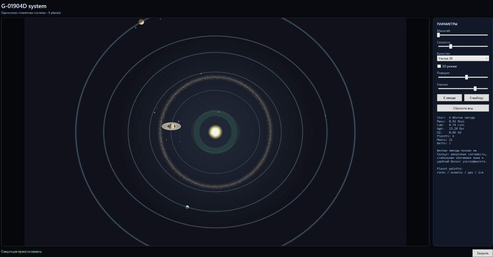
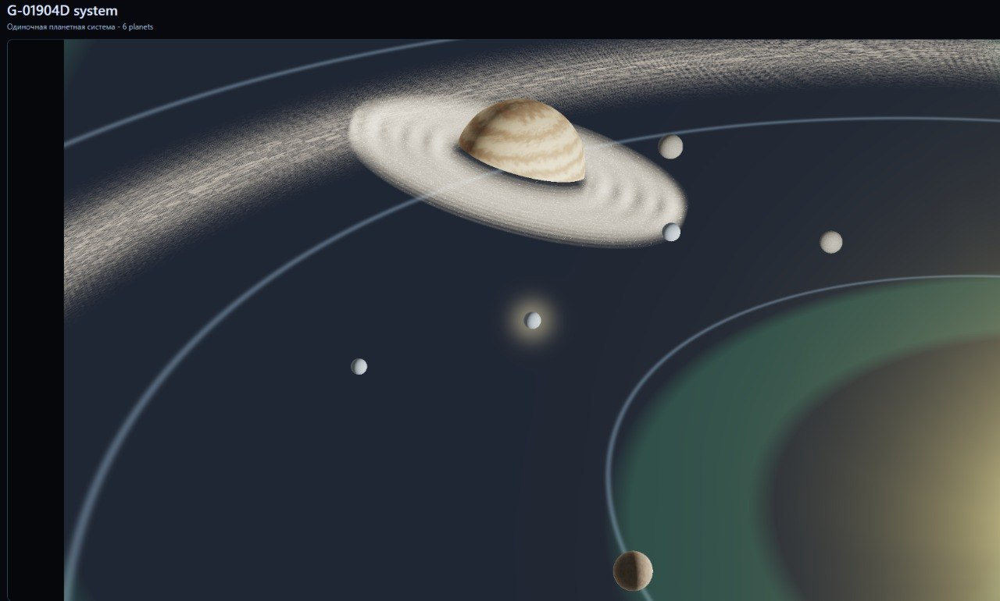
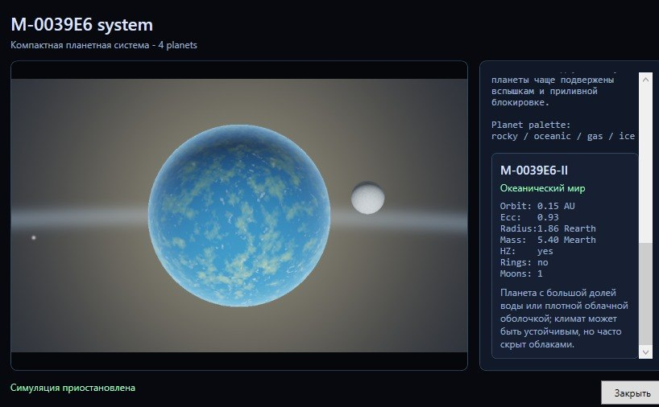
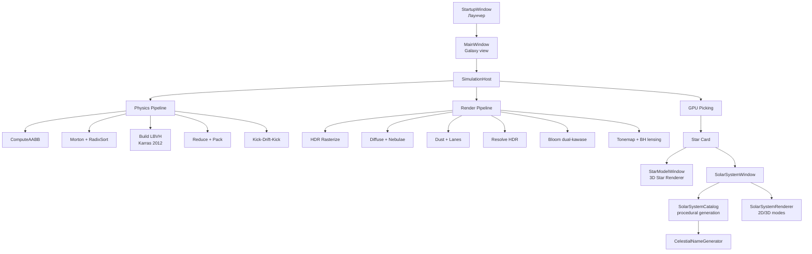

[README .md](https://github.com/user-attachments/files/27161862/README.md)
# Galaxy Sim 🌌

> GPU-симуляция галактики на C# / ComputeSharp 3.2 — N-body физика, интерактивное исследование звёздных систем, процедурная генерация планет



[]()
[]()
[]()
[]()
[](LICENSE)

---

## ✨ Что это

**Galaxy Sim** — визуально насыщенная симуляция галактики, которую можно исследовать. Не строгий астрофизический инструмент, а интерактивная модель: летает галактика с пылью, звёздами и центральной чёрной дырой, кликаешь по звезде — открывается её карточка, идёшь в звёздную систему — там процедурно сгенерированные планеты со спутниками, кольцами и атмосферами.

Основные расчёты и большая часть рендера выполняются на GPU через **ComputeSharp 3.2** (DirectX 12). Это даёт десятки тысяч частиц при интерактивном FPS даже на средних видеокартах, и до миллиона частиц на топовых.

---

## 🎯 Features

### Симуляция галактики
- 🌀 **N-body физика** до 1M частиц через **Barnes–Hut O(N log N)**
- 🎛 **Пресеты количества звёзд:** 8K → 16K → 32K → 64K → 128K → 256K → 512K → 1M
- 🌌 **5 пресетов галактик:** Млечный Путь, Андромеда, NGC 1300 (барная), M74, карликовая
- 🕳 **Чёрная дыра** в центре с screen-space линзированием
- 💨 **Пыль галактического диска** с coherent dust lanes и подавлением blob-артефактов
- 🌠 **HDR рендер** с dual-kawase bloom, ACES tonemap и локальным контрастом
- ⚛️ **Гало + балдж** в физической модели — стабильное ядро без коллапса

### Интерактивность
- 🖱 **Клик по любой звезде** — открывается карточка с параметрами и описанием
- ⭐ **3D-модель звезды** — фотосфера, корона, протуберанцы, грануляция
- 🪐 **Звёздные системы** — процедурная генерация на основе seed выбранной звезды
- 🌍 **6 типов планет:** каменные, океанические, газовые гиганты, ледяные гиганты, ледяные далёкие, лава-миры
- 💍 **Кольца, спутники, астероидные пояса** — у разных классов планет
- 🌊 **Habitable zone** — планеты в обитаемой зоне могут быть океаническими с атмосферой и облаками
- 🔥 **Горячие газовые гиганты** возле звезды получают красные прожилки раскалённого газа
- 🌑 **Mutual shadows** — спутники отбрасывают тени на родительскую планету и наоборот

### Naming engine
- 🎲 **Процедурный генератор имён** для звёзд, планет, спутников и поясов
- 🎼 **Разные шаблоны** для разных типов объектов: космические для звёзд, географические для планет, мифологические для спутников
- 🔢 **Детерминизм:** одна и та же звезда всегда получает одно и то же имя
- 📚 **>1M уникальных имён** благодаря процедурным слогам с эпитетами и регионами

### Просмотр и качество
- 🎬 **2D и 3D режимы** просмотра звёздных систем
- 📐 **Реалистичный масштаб** — реальные пропорции орбит с маркерами для выбора
- 🖥 **Качество рендера систем:** Быстро / Баланс / Высокое / Ультра 2K
- 🌐 **Локализация RU/EN** в лаунчере и системном просмотрщике

---

## 📷 Screenshots

| Galaxy view | Star card |
|:---:|:---:|
|  |  |
| 1M частиц на пресете Milky Way | Карточка с процедурным именем и параметрами |

| 3D Star renderer | Solar system 2D map |
|:---:|:---:|
|  |  |
| Фотосфера, корона, протуберанцы | Habitable zone, кольца, пояса |

| Solar system 3D | Ocean planet |
|:---:|:---:|
|  |  |
| Газовый гигант с кольцами и спутниками | Океанический мир с атмосферой и облаками |

---

## 🚀 Quick Start

### Требования
- **Windows 10/11**
- **.NET 9 SDK** для сборки из исходников
- **GPU с поддержкой Direct3D 12**
- Для тяжёлых пресетов (`512K`, `1M`, `QHD`, `4K`) — дискретная видеокарта с запасом VRAM

### Сборка
```powershell
git clone https://github.com/yourname/GalaxySim.git
cd GalaxySim

dotnet restore .\GalaxySim.sln
dotnet build .\GalaxySim.sln -c Release
dotnet run --project .\GalaxySim\GalaxySim.csproj -c Release
```

Или открыть `GalaxySim.sln` в Visual Studio 2022 и запустить проект `GalaxySim`.

Готовый exe после Release-сборки:
```
GalaxySim\bin\Release\net9.0-windows\GalaxySim.exe
```

### Self-contained релиз
```powershell
dotnet publish .\GalaxySim\GalaxySim.csproj -c Release -r win-x64 --self-contained true
```

---

## 📊 Performance

Бенчмарки на референсном железе с пресетом Milky Way и θ = 1.5:

| GPU | Stars | Render | Phys (ms) | Total (ms) | FPS |
|---|---|---|---|---|---|
| RTX 3060 (12GB) | 128K | 1280×720 | 5.8 | 17 | **44** |
| RTX 3060 (12GB) | 128K | 1920×1080 | 5.8 | 21 | **38** |
| RTX 3060 (12GB) | 256K | 1280×720 | 11 | 25 | **30** |
| RTX 5070 Ti | 128K | 1920×1080 | ~2 | 8 | **120+** |
| RTX 5070 Ti | 1M | 3840×2160 (4K) | ~30 | 55-65 | **15-18** |

*Phys = время физического шага. Total = phys + render + readback. Frame timings после 10 секунд прогрева.*

### Рекомендации по настройкам

- **Для разработки и быстрых итераций:** `32K` или `64K` частиц, `1280×720`
- **Для интерактивных скриншотов:** `128K` частиц, `1920×1080`, всё включено
- **Для максимальной нагрузки:** `1M` частиц, `4K`, готовиться к 10-20 FPS
- **Если кадр дорогой:** отключить nebulae, diffuse или unresolved starlight через слайдеры
- **Для просмотра звёздных систем:** `Баланс` для постоянной работы, `Ультра 2K` точечно для скриншотов

---

## 🏗 Architecture



### Структура проекта

```
GalaxySim/
├── GalaxySim.sln
└── GalaxySim/
    ├── App.xaml
    ├── StartupWindow.xaml/.cs       — лаунчер
    ├── MainWindow.xaml/.cs          — главное окно галактики
    ├── StarModelWindow.xaml/.cs     — 3D-модель звезды
    ├── SolarSystemWindow.xaml/.cs   — просмотрщик системы
    ├── StarGpuRenderer.cs           — GPU renderer звезды
    ├── SolarSystemRenderer.cs       — GPU renderer системы
    ├── StarModelFactory.cs          — WPF 3D helper (legacy)
    ├── AppLanguage.cs               — локализация
    └── Core/
        ├── Camera/                   — управление камерой
        ├── Physics/                  — физические параметры
        ├── Simulation/               — генерация и хост симуляции
        ├── Shaders/                  — все compute shaders
        └── Tree/                     — Barnes-Hut BVH
```

---

## 🎮 Как пользоваться

### Лаунчер

При запуске открывается окно стартовых настроек:

- **Количество звёзд** — размер симуляции (8K → 1M)
- **Тип галактики** — визуально-физический пресет (Млечный Путь, Андромеда и т.д.)
- **Разрешение рендера** — размер GPU render target (1280×720 → 4K)
- **Русский / English** — переключение языка

Для слабых GPU начинать с `32K` или `64K` и `1280×720`.

### Галактическая карта

- **ЛКМ** — вращение камеры
- **Колесо мыши** — масштабирование
- **Клик по звезде** — выбор звезды и открытие карточки
- **Pause / Reset** — управление симуляцией
- **Screenshot** — сохранение в `Pictures\GalaxySim`

Группы настроек на боковой панели: физика, визуал, пыль, bloom, чёрная дыра, статистика времени кадра.

### Карточка звезды

После клика по звезде:
- Имя (процедурное), спектральный класс, тип
- Масса, температура, радиус, светимость, возраст
- Количество планет, обитаемая зона, позиция, скорость
- Кнопки: **3D-модель** и **Звёздная система**

### Просмотр 3D-модели звезды

Окно с процедурной GPU-визуализацией:
- Анимированная фотосфера с грануляцией
- Корона и протуберанцы
- Вращение, наклон, масштабирование

Звёзды разных типов получают разные цвета, размеры и параметры активности.

### Просмотр звёздной системы

Окно показывает процедурно созданную систему:
- **2D-режим** — плоская карта с орбитами и habitable zone
- **3D-режим** — объёмный вид с тенями и атмосферой
- **Реалистичный масштаб** — приближённые к реальности расстояния, с маркерами
- Клик по планетам/спутникам открывает их карточки
- Управление скоростью симуляции и качеством рендера

---

## 🔬 Технические детали

### Что под капотом

Несколько техник, которые делают эту симуляцию интересной с инженерной точки зрения:

**Barnes–Hut с GPU-LBVH.** Дерево строится через 30-bit Morton codes (Z-order), GPU radix sort за 4 прохода × 8 бит, затем параллельный Karras 2012 алгоритм для топологии BVH. Стэклесс-обход через parent/leftChild/rightChild pointers — без shared memory, которой в ComputeSharp 3.2 нет.

**HDR через uint atomic buffers.** ComputeSharp 3.2 не поддерживает HDR pixel formats для `ReadWriteTexture2D`. Решение: три `ReadWriteBuffer<uint>` для R/G/B с накоплением через `Hlsl.InterlockedAdd` и fixed-point scale = 4096. Это даёт значения яркости >1 (нужно для bloom) при сохранении atomic blend.

**Dual-kawase bloom.** 6-уровневая mip chain, downsample → upsample с накоплением. Каждый уровень — простой compute shader без shared memory. Стоимость ~3 мс на 1080p против ~15 мс для классического Gaussian.

**Beer–Lambert dust absorption.** Пыль не вычитает свет напрямую (uint underflow). Вместо этого пишет opacity в отдельный буфер, на этапе ResolveHDR применяется `transmission = exp(-tau * dustStrength)`. Физически корректное поглощение.

**Stable star naming.** Имена детерминированы через `seed = starIndex × prime + salt`. Кликаешь на звезду в галактике, переходишь в систему, возвращаешься — имя то же. Покрытие >1M уникальных вариантов через процедурные слоги.

### Производительность: история оптимизации

Проект прошёл несколько фаз оптимизации. На референсном RTX 3060 phys для 128K частиц:

```
Начало Phase 3 (naive Barnes-Hut)    272 ms     →  5-7 FPS
+ Compact traversal layout           ~180 ms    →  8-10 FPS
+ Skip pointers + θ tuning           ~90 ms     →  ~15 FPS
+ Удаление per-frame stalls,
  фикс GPU↔CPU roundtrip,
  правильный buffer lifecycle        21 ms      →  30 FPS
+ θ = 1.5                            5.8 ms     →  44 FPS
```

Финальное ускорение **~45×** на физике. Самым большим выигрышем оказался не алгоритмический (skip pointers), а архитектурный (удаление stalls и лишних аллокаций).

### Шейдерный пайплайн

Render выполняет следующие проходы на GPU:

1. **ClearShader** — очистка HDR-буферов
2. **DiffuseShader** — мягкое тело галактики
3. **NebulaeShader** — HII регионы
4. **BackgroundStarsShader** — фоновые звёзды
5. **RasterizeShader** — звёзды галактики
6. **UnresolvedStarlightShader** — непрерывное свечение
7. **DustShader** — пыль
8. **CoherentDustLanesShader** — крупные пылевые рукава
9. **ResolveHDRShader** — сборка с absorption и blob suppression
10. **BloomThresholdShader** → **Downsample** ×5 → **Upsample** ×5
11. **TonemapShader** — ACES + bloom + локальный контраст + BH-lensing
12. **Readback** в `WriteableBitmap`

### Линзирование чёрной дыры

Реализовано в screen-space на этапе TonemapShader. `BuildBlackHoleLensingData` проецирует центр галактики в экранные координаты, передаёт масштаб массы и близость камеры. Шейдер смещает UV вокруг центра, формирует тёмный диск и фотонное кольцо. Это **визуальная аппроксимация**, не физическая трассировка геодезик.

### Каталоги и генерация

`StarCatalog.cs` строит доменную модель звезды из частицы (класс M/K/G/F/A/B/O, масса, светимость, возраст). `SolarSystemCatalog.cs` генерирует планетные системы по архитектуре (compact / solar-like / giant-rich / debris-heavy). `CelestialNameGenerator.cs` собирает имена из греческих префиксов, корней, регионов и процедурных слогов с разными шаблонами для звёзд, планет и спутников.

---

## 📈 Roadmap

Этот список не является обязательством по срокам. Он фиксирует направления и мои желания, которые логично было бы развивать после первого публичного релиза.
Я просто пока не уверен.

## Ближайшие улучшения

- Полная локализация через `.resx` или централизованный словарь.
- Сохранение пользовательских настроек между запусками.
- Горячие клавиши для камеры, паузы, скриншота и сброса вида.
- Экспорт seed выбранной звезды и звездной системы.
- Экспорт скриншотов из просмотрщика звезды и просмотрщика системы.
- Профили качества: `Low`, `Balanced`, `High`, `Screenshot`.

## Визуал

- Более детальные типы звезд: белые карлики, красные гиганты, нейтронные звезды.
- Аккреционный диск для центральной черной дыры как отдельный режим.
- Улучшенная атмосфера планет с фазовым рассеянием.
- Более разнообразные кольца: пастушьи спутники, разрывы, наклонные фрагменты.
- Более выраженные погодные паттерны на газовых гигантах.
- Туманности и звездные скопления как отдельные выбираемые объекты.

## Симуляция

- Несколько режимов физики: `Visual`, `Stable`, `Experimental`.
- Более строгие единицы измерения для режима реалистичного масштаба.
- Возврат сценария столкновений галактик как отдельного экспериментального режима.
- Более гибкая модель темной материи и гало.
- Генерация баров, рукавов и колец галактики через отдельные пресеты.

## Звездные системы

- Сохранение и повторное открытие конкретной системы по seed.
- Фильтр/поиск по объектам системы.
- Больше типов планет и подтипов атмосфер.
- Карточки астероидных поясов и колец как выбираемых объектов.
- Орбитальные резонансы и наклоненные орбиты для части планет.
- Простая эволюционная модель возраста системы.

---

## 🛠 Расширение проекта

### Добавить новый пресет галактики

1. Добавить значение в `GalaxyPresetType`
2. Добавить объект в `GalaxyPreset.Get`
3. Добавить пункт в `StartupWindow.xaml.cs`
4. Проверить стабильность `GalaxyInitializer` с новыми параметрами
5. Проверить визуальный баланс пыли, гало и bloom

### Добавить новый тип планеты

1. Добавить новый `typeCode` в `SolarSystemCatalog`
2. Обновить `TypeName`, `DescriptionFor`, `RadiusEarth`, `MassEarth`, `VisualRadius`
3. Добавить ветку в `SolarSystemRenderShader.PlanetAlbedo`
4. При необходимости обновить генерацию спутников и колец
5. Добавить суффиксы имён в `CelestialNameGenerator`

### Добавить новый GPU-проход

1. Создать shader struct в `Core/Shaders`
2. Добавить нужные buffers/textures в `SimulationHost`
3. Корректно инициализировать и освобождать ресурсы
4. Вставить `_device.For(...)` в правильное место пайплайна
5. Проверить readback и отсутствие лишних CPU↔GPU синхронизаций

> **Важно:** readback с GPU на CPU дорогой. Для интерактивной производительности держать данные на GPU и читать только минимальный результат, как сделано для picking.

---

## ⚠️ Ограничения

- Это **визуальная симуляция**, не научный инструмент
- Линзирование чёрной дыры — screen-space эффект, не настоящая трассировка геодезик
- Масштабы в обычном режиме художественные — для читаемости системы
- Режим реалистичного масштаба приближает расстояния, но не является строгой астрономической моделью
- Сценарий столкновения галактик отсутствует в текущем релизе
- ComputeSharp требует совместимого GPU и драйвера

---

## 🤝 Acknowledgements

Проект — результат итеративной работы при содействии AI-ассистентов **Claude (Anthropic)** и **GPT (OpenAI)** для архитектурных решений, отладки шейдеров и обсуждения подходов. Финальные решения, реализация, отладка реальной системы и оптимизация — авторские.

Спасибо:
- **Sergio Pedri** — за [ComputeSharp](https://github.com/Sergio0694/ComputeSharp), фантастическую библиотеку
- **J. Barnes & P. Hut (1986)** — за оригинальный алгоритм Barnes–Hut
- **T. Karras (2012)** — за параллельную конструкцию LBVH
- Авторам [dual-kawase blur](https://community.arm.com/cfs-file/__key/communityserver-blogs-components-weblogfiles/00-00-00-20-66/siggraph2015_2D00_mmg_2D00_marius_2D00_notes.pdf) — за элегантный bloom

---

## 📄 License

[MIT License](LICENSE) — свободно используй, модифицируй, распространяй.

---

## 📬 Contact

Открой issue на GitHub, если найдёшь баг, есть идея, или хочешь обсудить архитектурное решение.

Если проект показался интересным — поставь ⭐ на репозитории, это помогает.

---

<sub>*Built with C#, ComputeSharp 3.2, and a lot of late-night debugging. May your galaxies be stable and your bloom not too aggressive.* 🌌</sub>
